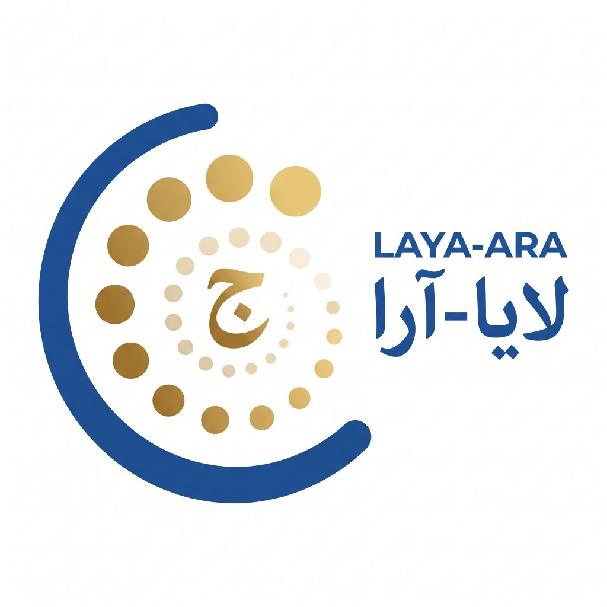

# laya-ara

<p align="center">
  
</p>

Arabic typed decisions (`choice` / `score` / `noul`) on [`convaiinnovations/laya-multilingual`](https://huggingface.co/convaiinnovations/laya-multilingual). Author: **Mohammad Alkhenizan**.

Not a chat model. Not a span-NER or span-QA head. Not a full-corpus retriever. Not TypeSafe Jev.

**Headline:** MASSIVE-ar intent, 20 options, **0.386 → 0.816**. Scenario 0.865 is an 18-way exam, not “MASSIVE intent.”

XNLI-ar was in this mix (**CC BY-NC 4.0**). Research / non-commercial. [`NOTICE.md`](NOTICE.md) · numbers [`results/v48_all_benches.json`](results/v48_all_benches.json).

Hub (private): [`Wouze/laya-ara`](https://huggingface.co/Wouze/laya-ara)

```python
import laya
agent = laya.load("Wouze/laya-ara")
```

## Locked suite (in the mix)

Same frozen JSONL. Stock = `laya-multilingual`. This card = v48 weights.

| Task | n | Metric | Stock | laya-ara | Δ |
|---|---:|---|---:|---:|---:|
| MASSIVE-ar scenario (18-way, test) | 2974 | acc | 0.427 | **0.865** | +43.8 |
| MASSIVE-ar intent, 20 options | 2974 | acc | 0.386 | **0.816** | +43.0 |
| MASSIVE-ar hierarchical intent (k≥2) | 2694 | acc | 0.536 | **0.893** | +35.7 |
| XNLI-ar (test) | 5010 | acc | 0.686 | **0.723** | +3.7 |
| OSACT4-A offense (val) | 1000 | macro-F1 | 0.726 | **0.862** | +13.6 |

OSACT-A acc 0.844 → 0.920. XNLI is mid, not AraBERT-class (~0.80).

## Translated Arabic NLU (zero-shot vs this mix)

Official labels. QA is **sentence pick**, not span EM/F1.

| Task | n | Metric | Stock | laya-ara | Δ |
|---|---:|---|---:|---:|---:|
| OSACT4-HS (hate) | 1000 | acc / F1 | **0.932 / 0.655** | 0.875 / 0.645 | −5.7 / −1.0 |
| AJGT sentiment | 360 | acc / F1 | **0.833 / 0.832** | 0.756 / 0.747 | −7.8 / −8.6 |
| LABR binary (drop 3★) | 2348 | acc / F1 | 0.759 / 0.758 | **0.766 / 0.764** | +0.7 / +0.6 |
| ASTD 4-way (hold 1500) | 1500 | acc / F1 | 0.295 / 0.286 | **0.326 / 0.297** | +3.1 / +1.1 |
| TyDiQA-ar sentence pick | 298 | acc / F1 | 0.359 / 0.155 | **0.413 / 0.170** | +5.4 / +1.5 |

AJGT and OSACT-HS got worse. ASTD is below majority Objective (~0.65).

## Arabic RAG (this card, no RAG train)

Relevance / rerank, k≤12. **Not** MIRACL nDCG@10. Pair chance 0.50. Rank chance ~0.083 (MIRACL 0.113).

| Task | Negatives | Pair n | Pair stock → laya-ara | Rank n | Rank stock → laya-ara |
|---|---|---:|---:|---:|---:|
| MIRACL-ar dev | human | 5792 | **0.688** → 0.629 | 2896 | 0.153 → **0.210** |
| Mr.TyDi-ar train 2k | BM25 | 4000 | **0.755** → 0.740 | 2000 | 0.176 → **0.260** |
| SadeemQuestion | random | 4178 | 0.837 → **0.919** | 2089 | 0.168 → **0.242** |
| PublicHealthQA-ar | random FAQ | 172 | **0.791** → 0.773 | 86 | 0.116 → **0.244** |
| Mintaka-ar | random entity | 4406 | 0.537 → **0.616** | 2203 | 0.285 → **0.311** |
| MLQA ara-ara 2k | random para | 4000 | 0.731 → **0.784** | 2000 | 0.133 → **0.214** |
| XPQA ara-ara | random answer | 1500 | 0.623 → **0.697** | 750 | 0.213 → **0.281** |

Listwise **7/7**. Pairwise: random-negs favor this card; MIRACL human / Mr.TyDi BM25 favor stock.

## Other checkpoints (not this card)

None of these replace laya-ara on MASSIVE / XNLI / OSACT-A. Details: [`FINDINGS.md`](FINDINGS.md).

### laya-ara-quote (no XNLI; sentiment/hate **fine-tune**)

| Task | n | Kind | Stock | laya-ara | quote |
|---|---:|---|---:|---:|---:|
| MASSIVE scenario | 2974 | in-mix | 0.427 | **0.865** | 0.822 |
| XNLI-ar | 5010 | quote zero-shot | 0.686 | **0.723** | 0.697 |
| OSACT-A acc / F1 | 1000 | in-mix | 0.844 / 0.726 | **0.920 / 0.862** | 0.901 / 0.823 |
| OSACT-HS acc / F1 | 1000 | **FT** | 0.932 / 0.655 | 0.875 / 0.645 | **0.963 / 0.677** |
| AJGT | 360 | **FT** | 0.833 / 0.832 | 0.756 / 0.747 | **0.875 / 0.875** |
| LABR | 2348 | **FT** | 0.759 / 0.758 | 0.766 / 0.764 | **0.834 / 0.834** |
| ASTD hold acc / F1 | 1500 | **FT** | 0.295 / 0.286 | 0.326 / 0.297 | **0.694 / 0.404** |
| TyDiQA-sent | 298 | transfer | 0.359 / 0.155 | **0.413 / 0.170** | 0.406 / 0.140 |

Do not advertise ASTD 0.694 as balanced 4-way (F1 0.404).

### laya-ara-rag (MIRACL train; still k≤12, not nDCG@10)

Listwise: all seven up. MIRACL-ar **dev** is in-family. The other reranks were not in the mix.

| Task | n | Kind | Stock | laya-ara | rag-ft |
|---|---:|---|---:|---:|---:|
| MIRACL-ar rerank (dev) | 2896 | in-family | 0.153 | 0.210 | **0.536** |
| Mr.TyDi-ar rerank | 2000 | transfer | 0.176 | 0.260 | **0.610** |
| SadeemQuestion rerank | 2089 | transfer | 0.168 | 0.242 | **0.781** |
| MLQA-ar rerank | 2000 | transfer | 0.133 | 0.214 | **0.507** |
| XPQA-ar rerank | 750 | transfer | 0.213 | 0.281 | **0.495** |

MIRACL pair 0.688 / 0.629 / **0.758**. Mintaka and MLQA **pair** dropped. Not a retriever.

### laya-ara-triage (synthetic Gulf, not real tickets)

Smoke churn 0.03 → **0.91**. hold200 queue 0.75 · churn F1 0.91 · urgency nearest **0.33**. Do not cite as production accuracy.

## Training

RLCD on 2×RTX 3090. Mix: MASSIVE-ar train + OSACT4-A + capped XNLI-ar. Hybrid temperatures (`choice:11+` floor 3.75).

## Limits

- XNLI in the mix → research / non-commercial. Do not upload raw XNLI or OSACT tweet dumps.
- Not a general Arabic BERT. Sentiment/hate transfer on this card is weak.
- RAG is a shortlist exam. 0.26 top-1@12 is not a retriever.
- No token NER, no span QA, no official MIRACL nDCG@10.
- Do not deploy unattended moderation.

## Cite

```bibtex
@misc{alkhenizan2026layaara,
  title        = {laya-ara},
  author       = {Alkhenizan, Mohammad},
  year         = {2026},
  howpublished = {\url{https://huggingface.co/Wouze/laya-ara}}
}
```

Encoder: Marone et al. 2025 (mmBERT). Dataset papers: [`citations.bib`](citations.bib).
